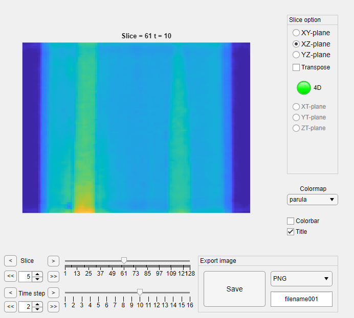
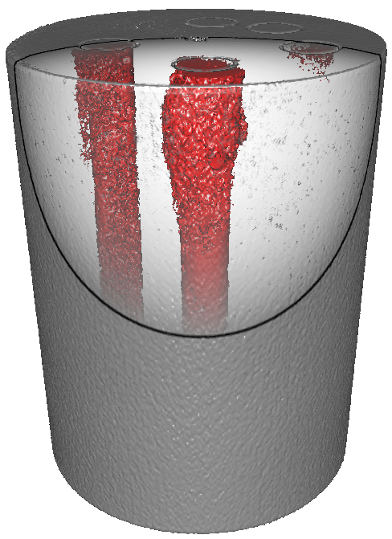
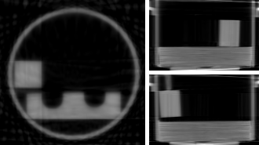
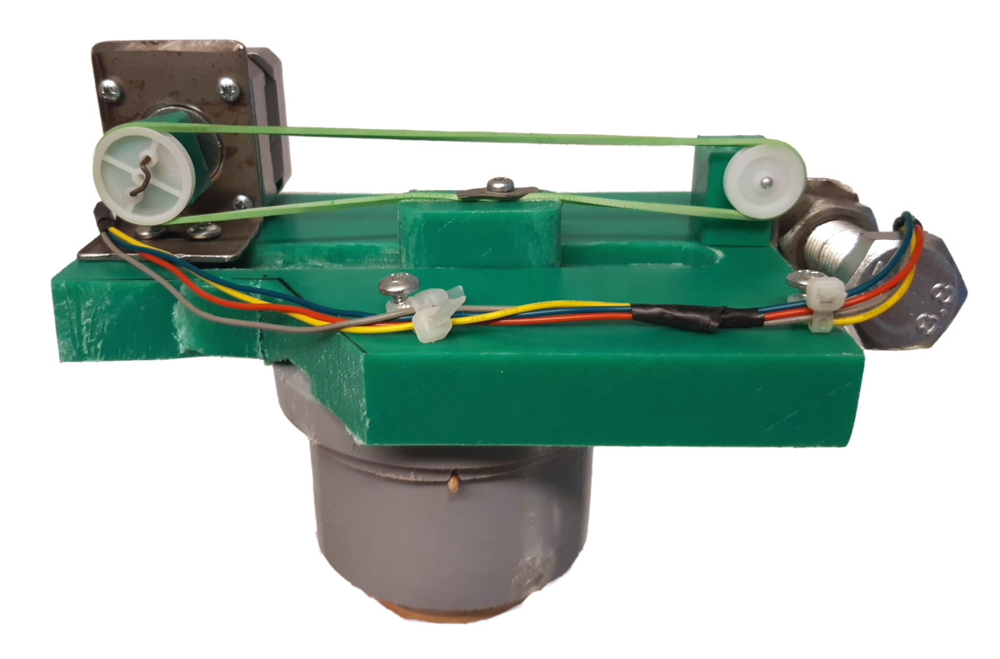
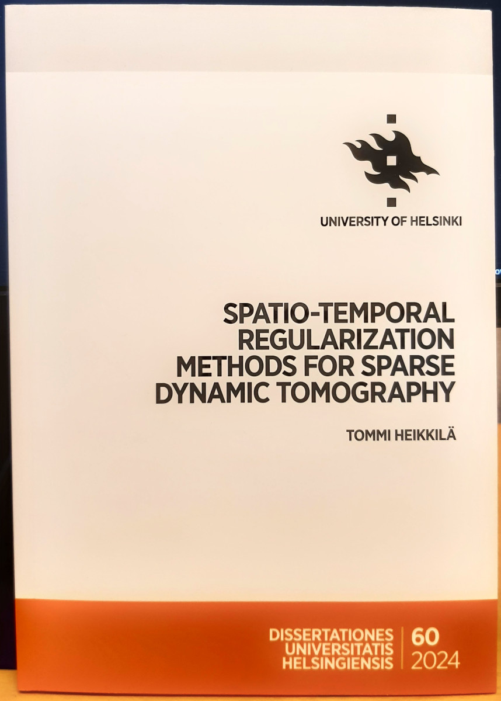

# Terve / Hello :wave:

## Summary

- Tommi Heikkilä, **PhD student** in the University of Helsinki, Finland
- **Working on**: applied math, inverse problems, sparse and dynamic tomography, wavelets and shearlets
- ORCID: [0000-0001-5505-8136](https://orcid.org/0000-0001-5505-8136)
- University of Helsinki [Research portal](https://researchportal.helsinki.fi/en/persons/tommi-heikkil%C3%A4)

## Software :clipboard:

- [randDynTomo](https://github.com/tommheik/randDynTomo): *Statistical inverse learning of randomly sampled dynamic tomograhy*  
Numerical validation of results in ["Regularization with optimal space-time priors"](#randDynTomo).
Collaboration with T.A. Bubba and L. Ratti.

- [3d_cylind_shear](https://github.com/tommheik/3d_cylind_shear): *3D Cylindrical shearlet transform for Matlab*  
(Most of the work by G. Easley and [D. Labate](https://www.math.uh.edu/~dlabate/index.html))

- [dualtree4](https://github.com/tommheik/dualtree4): *4D dual-tree complex wavelet transform for Matlab*

- [wavedec4](https://github.com/tommheik/wavedec4): *4D Discrete wavelet transform for Matlab*

- [4dCylindricalShearlet](https://github.com/tommheik/4dCylindricalShearlet): *4D Cylindrical shearlet transform for Matlab*

- [sliceViewerApp](https://github.com/tommheik/sliceViewerApp): *Matlab app for viewing slices of 4D and 3D volumes*  
  

## Open data :open_file_folder:

- **T.H**, H. Help & A. Meaney,  
    *Cone-beam Gel phantom data for dynamic X-ray tomography* (2023). [DOI:10.5281/zenodo.7739984](https://doi.org/10.5281/zenodo.7739984)  
     

- **T.H**, 
    *STEMPO - dynamic X-ray tomography phantom* (2022). [DOI:10.5281/zenodo.7081688](https://doi.org/10.5281/zenodo.7081688)  
      

- **T.H**, H. Help & A. Meaney,  
    *Gel phantom data for dynamic X-ray tomography* (2020). [DOI:10.5281/zenodo.3696816](https://doi.org/10.5281/zenodo.3696816)

## Research :scroll:

- T.A. Bubba, **T.H**, D. Labate & L. Ratti,  
    *Regularization with optimal space-time priors* (2024). 
    [arXiv:2405.06337](https://arxiv.org/abs/2405.06337)

- J-B. Fest, **T.H**, I. Loris, S. Martin, L. Ratti, S: Rebegoldi & G. Sarnighausen,  
    *On a fixed point continuation method for a convex optimization problem* (2022). [arXiv:2212.12256](https://arxiv.org/abs/2212.12256)

- **T.H**,  
    *STEMPO - dynamic X-ray omography phantom* (2022). To appear in *Advanced Techniques in Optimization for Machine learning and Imaging* (ATOMI), Springer INdAM Series. [arXiv:2209.12471](https://arxiv.org/abs/2209.12471)

- T.A. Bubba, G. Easley, **T.H**, D. Labate & J.P. Rodriguez Ayllon,  
    *Efficient representation of spatio-temporal data using cylindrical shearlets* (2023). Journal of Computational and Applied Mathematics 429, 115206. [DOI:10.1016/j.cam.2023.115206](https://doi.org/10.1016/j.cam.2023.115206)

- T.A. Bubba, **T.H** & S. Siltanen,  
    *4D dual-tree complex wavelets for time-dependent data* (2021). 21st International Conference on Computational Science and Its Applications (ICCSA), IEEE, p. 146-156. [DOI:10.1109/ICCSA54496.2021.00029](https://doi.org/10.1109/ICCSA54496.2021.00029)

- T.A. Bubba, **T.H**, H. Help, S. Huotari, Y. Salmon & S. Siltanen,  
    *Sparse dynamic tomography: Shearlet-based approach for iodine perfusion in plant stems* (2020). Inverse Problems 36, 094002. [DOI:10.1088/1361-6420/ab9c15](https://doi.org/10.1088/1361-6420/ab9c15)

## Other :cow:

- [*Spatio-temporal regularization methods for sparse dynamic tomography*](http://hdl.handle.net/10138/571262) (2024),  
PhD thesis, University of Helsinki, Finland. Dissertationes Universitatis Helsingiensis 60/2024.  
 

    Last edited May 14, 2024
